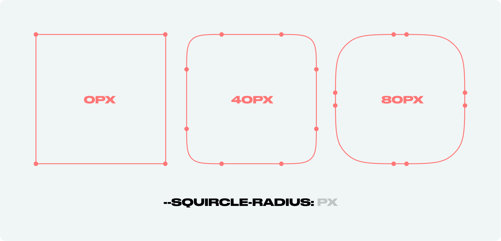
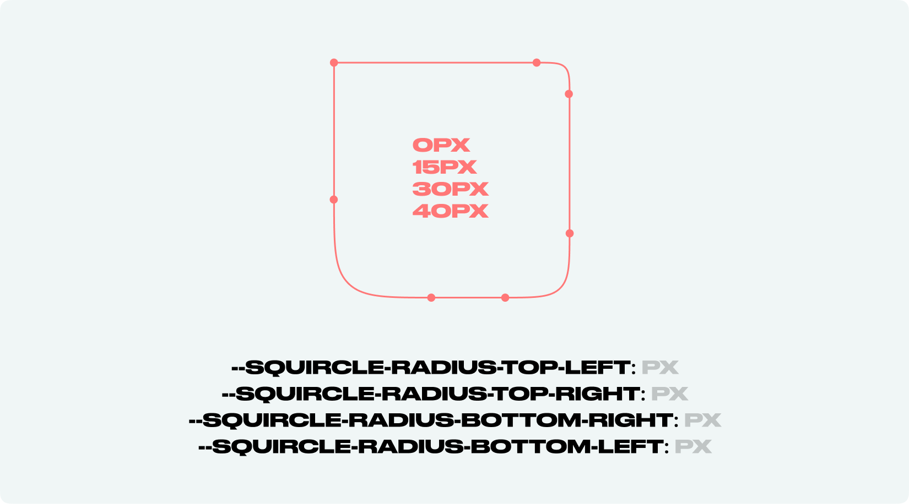
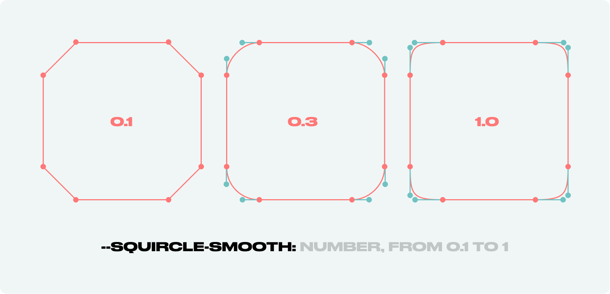
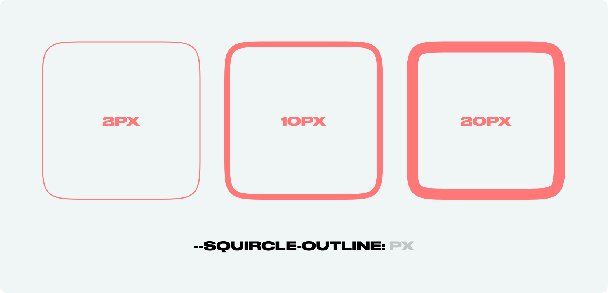
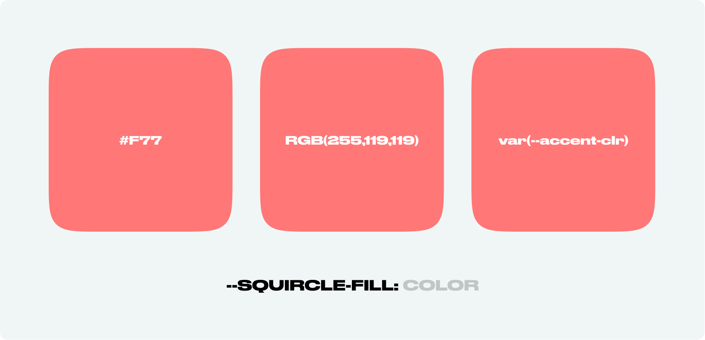

# Squircle CSS Houdini


A tiny CSS Houdini module that allows adding a squircle shape to HTML elements.

---

### 🎻  [Demo on GitHub Pages](https://pavellaptev.github.io/squircle-houdini-css/)

### 👾  [Codepen examples](https://codepen.io/collection/XjgQqp)

### 📦  [NPM package](https://www.npmjs.com/package/css-houdini-squircle)

### 🗞  [Medium article](https://pavellaptev.medium.com/squircles-on-the-web-houdini-to-the-rescue-5ef11f646b72)

---

# 🚀 Usage

## Add the script

In order to use the module, you need to add the script to your HTML file. But it's not a usual JS module that you can import.

 
```js
// Vanilla JS and Create React App
// Add the script to the index.html file

<script>
  if ("paintWorklet" in CSS) {
    CSS.paintWorklet.addModule(
      "https://www.unpkg.com/css-houdini-squircle/squircle.min.js"
    );
  }
</script>

```

```tsx
// NextJS for TSX files
// Add the script to the _app.js file (or any other file that is loaded on every page)

React.useEffect(() => {
  (CSS as any).paintWorklet.addModule("squircle.min.js");
}, []);
```

## Add the styles

```css
/* use mask */
.squircle {
  width: 200px;
  height: 200px;
  background: linear-gradient(45deg, yellow, blue);
  --squircle-smooth: 1;
  --squircle-radius: 10px;
  mask-image: paint(squircle);
}
```
```css
/* use background */
.squircle {
  width: 200px;
  height: 200px;
  background: paint(squircle);
  --squircle-smooth: 1;
  --squircle-radius: 10px;
  --squircle-fill: #f45;
}
```

## 👉 [codepen example](https://codepen.io/PavelLaptev/pen/PoWjzyB)

---

# 🎛  Custom CSS Properties



## --squircle-radius property

The property controls the roundness of the corners.
You can provide 1, 2, 3 or 4 values, similar to padding/margin in CSS.
The order is clockwise: top left, top right, bottom right, bottom left

- Syntax: **`<px>`** OR **`<px px>`**  OR **`<px px px>`** OR **`<px px px px>`**
- Defaul value: **`8px`** (if no radius at all is defined) OR: **`0`** (if only some radii are defined)
- Min/Max values: **`—`** (the radii are capped at half of the shorter side of width/ height)

#### --squircle-radius-top-left, --squircle-radius-top-right, --squircle-radius-bottom-right, --squircle-radius-bottom-left

Set radii for the corners individually

```css
/* Usage */

.squircle {
  /* other properties */
  width: 200px;
	height: 200px;
  background: paint(squircle);
  /* the property */
  --squircle-radius: 20px;
}
```

---



## individual border radius

The property controls the roundness of the corners individually.

```css
/* Usage */

.squircle {
  /* other properties */
  width: 200px;
	height: 200px;
  background: paint(squircle);
  /* the property */
  --squircle-radius-top-left: 0px;
	--squircle-radius-top-right: 15px;
	--squircle-radius-bottom-right: 30px;
	--squircle-radius-bottom-left: 40px;
}
```

---



## --squircle-smooth property

The property controls the length of bezier guide lines. Could be defined by `--squircle-ratio`.

- Syntax: **`<number>`**
- Defaul value: **`1`**
- Min/Max values: **`0.1 / 1`**

```css
/* Usage */

.squircle {
  /* other properties */
  width: 200px;
	height: 200px;
  background: paint(squircle);
  --squircle-radius: 20px;
  /* the property */
  --squircle-smooth: 0.5;
}
```

---



## --squircle-outline property

The property controls squircle outline. There are two methods how too use it with `background-mask` and `mask`+`:pseudo-element`. to find out more check [codepen examples](https://codepen.io/collection/XjgQqp).

- Syntax: **`<px>`**
- Defaul value: **`—`**
- Min/Max values: **`—`**

```css
/* Usage */

.squircle {
  /* other properties */
  width: 200px;
	height: 200px;
  background: paint(squircle);
  --squircle-radius: 20px;
  /* the property */
  --squircle-outline: 5px;
}
```

---



## --squircle-fill property

The property accepts any color, including variables.

⚠️ Work only with `background: paint(squircle);`. For `mask-image: paint(squircle);` use `background` property.

- Syntax: **`<color>`**
- Defaul value: **`#f45`**
- Min/Max values: **`—`**

```css
/* Usage */

.squircle {
  /* other properties */
  width: 200px;
	height: 200px;
  background: paint(squircle);
  --squircle-radius: 20px;
  /* the property */
  --squircle-fill: #f45;
}
```


---

## 🕹  How to install particular version

```js
// latest version
<script>
  if ("paintWorklet" in CSS) {
    CSS.paintWorklet.addModule(
      "https://www.unpkg.com/css-houdini-squircle/squircle.min.js"
    );
  }
</script>

// or particular version
<script>
  if ("paintWorklet" in CSS) {
    CSS.paintWorklet.addModule(
      "https://www.unpkg.com/css-houdini-squircle@0.3.0/squircle.min.js"
    );
  }
</script>
```

#### Install via NPM

```
npm i css-houdini-squircle
```

#### Download

You can download the min version of the module [from UNPKG](https://www.unpkg.com/browse/css-houdini-squircle/squircle.min.js)

```
// latest version
https://www.unpkg.com/browse/css-houdini-squircle/squircle.min.js
```

---

## ✨  Use `css-paint-polyfill`

In order to get the module work on other browsers, you can use [Paint Worklets polyfill](https://github.com/GoogleChromeLabs/css-paint-polyfill).

⚠️ Check for artefacts before deploying.

```js
// use with polifill example
<script>
  (async function () {
    if (!("paintWorklet" in CSS)) {
      await import("css-paint-polyfill");
    }

    CSS.paintWorklet.addModule(
      `https://www.unpkg.com/css-houdini-squircle/squircle.min.js`
    );
  })();
</script>
```

---

## Contributing and testing

If you have any ideas, just [open an issue](https://github.com/PavelLaptev/squircle-houdini-css/issues) and tell what you think.

If you'd like to contribute, please fork the repository. Pull requests are warmly welcome.

The project structure is separated into `nextJS` app and `lib` folder. The `lib` folder contains the script itself. The `nextJS` app is used for the demo. The `lib` folder is a separate NPM package.


```
📁 root
  📁 lib
    - package.json
    - squircle.js
  📁 … other nextJS folders
```

In order to test the script locally:

1. you need to run `npm run dev` in the root folder. It will start the NextJS app.
2. Then you need to run `npm run watch:build` in the `lib` folder. It will start the watcher for the script. It will build the script every time you change it and create `squircle.min.js` file in the `lib` folder and in the `public` folder of the NextJS app.
3. In the `index.tsx` file of the NextJS app, you can uncomment the line with [test section](https://github.com/PavelLaptev/squircle-houdini-css/blob/70f81510d45185e3946ec2cbec3cd4ab6495224b/src/pages/index.tsx#L57) un comment other in order to ease the development process.

---

## Change log (v0.3.0)

- Removed `--squircle-ratio` property. It's now fixed to `1.8`. It's still possible to change the ratio by changing `--squircle-smooth` property.
- Moved the demo to NextJS
- Added `--squircle-radius-top-left`, `--squircle-radius-top-right`, `--squircle-radius-bottom-right`, `--squircle-radius-bottom-left` properties
- Added separate `lib` folder only for the script
